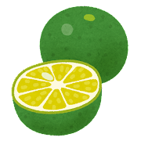

## Simple slide

Hello World

### Image

Vertical slide with an image.



### Code block

Text with Haskell code.

```Haskell
yonedaMap :: (forall x. (a -> x) -> f x) -> f a
yonedaMap tau = tau id

yonedaMap' :: Functor f => f a -> (forall x. (a -> x) -> f x)
yonedaMap' a = \f -> fmap f a

coyonedaMap :: (forall x. (x -> a) -> f x) -> f a
coyonedaMap tau = tau id

coyonedaMap' :: Contravariant f => f a -> forall x. (x -> a) -> f x
coyonedaMap' a = \f -> contramap f a
```

## Fragments

Text with revealjs fragments.

See [Reveal.js docs](https://revealjs.com/fragments/) for further info.

::: {.fragment .fade-out}
1. Fade out
2. Fade out
3. Fade out
:::

## Incremental

See [Pandoc docs](https://pandoc.org/MANUAL.html#incremental-lists) for further info.

::: incremental
1. Item 1
2. Item 2
3. Item 3
:::

### Speaker notes

Type the 's' key to show the notes.

::: notes
This is my note.
- Topic 1
- Topic 2
:::

### Columns

:::::::::::::: {.columns}
::: {.column width="40%"}
Split contents on the left side.
:::

::: {.column width="60%"}
Split contents on the right side.
:::
::::::::::::::

## Latex

Text with Katex.

See [Katex docs](https://katex.org/docs/supported) for further information.

$$
A \simeq B \xLeftrightarrow{\mathrm{def}}
\begin{aligned}
g \circ f &= \mathrm{id}_A  \\
f \circ g &= \mathrm{id}_B
\end{aligned}
$$
